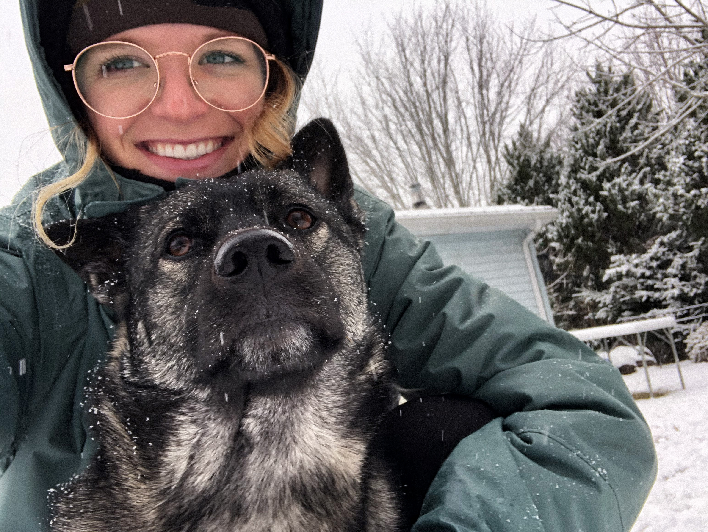

Lauren Barfield
=
*Senior at Appalachian State University in Boone, North Carolina*

[_view portfolio_](https://laurenbarfield8.wixsite.com/portfolio)

-----
Education
--
* _Appalachian State University_
  * B.S. in Geography
  * Certificate in Geographic Information Systems
  * 3.7 GPA

-----
Coursework
--
* Cartographic Design & Analysis
* Quantitative Methods
* Geospatial Data & Technology
* Intro and Advanced GIS
* Town, City, and Regional Planning !
* Environmental Regulation & Enforcement
* Land, Property, and Law

-----
Work Experience
--
##### High Gravity Adventures Aerial Park | _02/19 - 06/21_
* Shift Supervisor/Manager, Zipline Guide, and Ropes Course Operator

##### Mountain 2 Sea Marketing | _05/18 - 12/18_
* Key Account Manager for independent marketing agency representing 7 outdoor brands in the Southeast U.S.

-----
Skills
--
ArcGIS Pro, ArcGIS Online, QGIS, Adobe Suite, Microsoft Office

-----
Interests
--
climate change studies and communication. environmental conservation. outdoor recreation. cartography.
